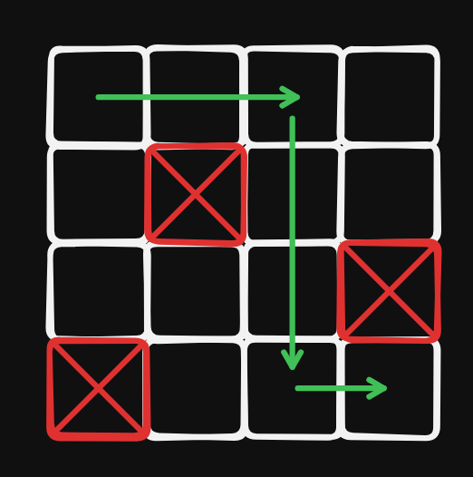
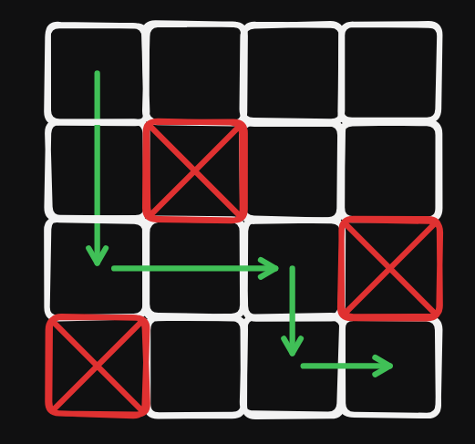
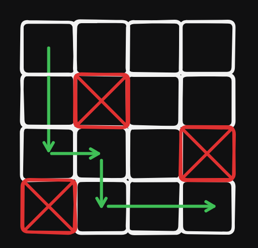
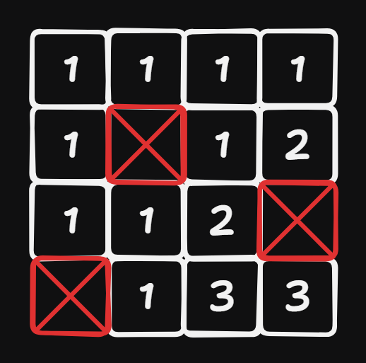

Grid Paths
===

題目
---
在一個大小為 $n \times n$ 的地圖上，並且地圖上可能會有陷阱，有幾種方法可以在不踩到陷阱的情況下從地圖的左上角走到右下角，並且每次只能往右走一格，或是往下走一格。

### 輸入
- 第一行輸入一正整數 $n$ 代表地圖的大小。（$1 \le n \le 1000$）
- 接下來會輸入 $n$ 行，且每行都有 $n$ 個字元，`*`代表陷阱，`.`代表空白的格子

### 輸出
輸出一個正整數，為答案模 $10^9+7$ 的值

範例測資
---
```
Input:
4
....
.*..
...*
*...

Output:
3
```






想法
---
假設有 $k$ 種方法可以走到當前的點，那麼右邊和下面的點會有 $k$ 種方法可以從當前的點走到。

### 狀態定義
設 $dp_{i, j}$ 為走到當前點的方法數

### 狀態轉移
- $dp_{i, j} = dp_{i - 1, j} + dp_{i, j - 1}$


轉移後的 DP 陣列會長這樣



**Note 1 :** 記得判斷不能從有陷阱的地方轉移

**Note 2 :** 如果座標 $(0, 0)$ 的位子是陷阱的話，$dp_{0, 0}$ 要設成 $0$，否則要設成 $1$

**Note 3 :** 記得特判終點是不是陷阱

### 範例程式碼
<details>
<summary>C++ 範例 </summary>

```cpp
#include <bits/stdc++.h>
#define IO ios_base::sync_with_stdio(0), cin.tie(0)
#define int long long 
using namespace std;

const int mod = 1e9 + 7;

char grid[1005][1005];
int dp[1005][1005];

signed main() {
    IO;
    int n;
    cin >> n;
    for(int i = 0; i < n; i++) {
        for(int j = 0; j < n; j++) {
            cin >> grid[i][j];
        }
    }
    if(grid[0][0] == '.') {
        dp[0][0] = 1;
    }
    for(int i = 0; i < n; i++) {
        for(int j = 0; j < n; j++) {
            if(grid[i][j] == '*') continue;
            if(i > 0) dp[i][j] += dp[i - 1][j]; 
            if(j > 0) dp[i][j] += dp[i][j - 1];
            dp[i][j] %= mod;
        }
    }
    if(grid[n - 1][n - 1] == '*') {
        cout << 0;
    }
    else {
        cout << dp[n - 1][n - 1];
    }
}
```
</details>