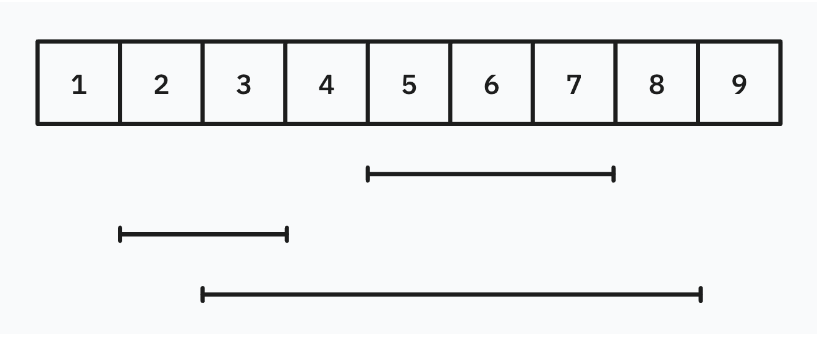

Restaurant Customers
===

## 題目
今天有 $n$ 個人到達與離開餐廳的時間，請問在任意時間點中，餐廳的最多人數是多少？

### 輸入
第一行有一個正整數 $n$。

接下來有 $n$ 行，每行有兩個相異正整數，分別代表第 $i$ 個顧客到達與離開餐廳的時間。

### 輸出
輸出一個正整數代表任意時間點中，餐廳的最多人數是多少？

## 範例測資
```
Input:
3
5 8
2 4
3 9

Output:
2
```



## 觀察
1. 數值範圍非常大但真正影響顧客數量的「時間點」很小。
2. 題目有類似區間加值，僅一次查詢的操作。

本題可以使用「掃描線＋差分」的方式解決。

## 想法
我們僅需關注題目給定的 $2n$ 個時間點，因為只有這 $2n$ 個時間點會影響人數。

將時間點包裝成 $(time, add)$，代表在時間 $time$，加上了 $add$ 人（$add$ 只會是 $1$ 或 $-1$），並依照時間點排序。

此時維護目前人數 $p$（初始為 $0$），並依序掃描過每個時間點，根據 $add$ 改變 $p$，並且每次都確認是否為最大值。

請注意，同個時間點中，$add$ 為 $-1$ 的元素必須在為 $1$ 的元素前面，否則可能會因先加再減，導致誤找到最大值。

### 範例程式碼

<details>
<summary>C++ 範例</summary>

```cpp
#include <bits/stdc++.h>
using namespace std;

int n;
int l, r;
vector<pair<int, int>> v;

int main(){

    // input
    cin >> n;
    for (int i=0 ; i<n ; i++){
        cin >> l >> r;
        v.push_back({l, 1});
        v.push_back({r, -1});
    }

    // process
    int p = 0;
    int ma = 0;
    sort(v.begin(), v.end());
    for (auto x : v){
        p += x.second;
        ma = max(ma, p);
    }

    // output
    cout << ma << "\n";

    return 0;
}
```

</details>