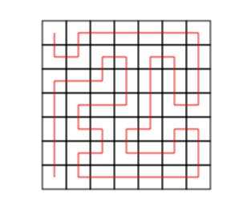
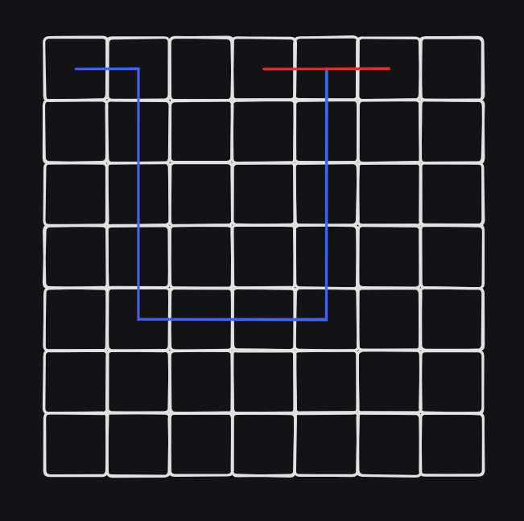
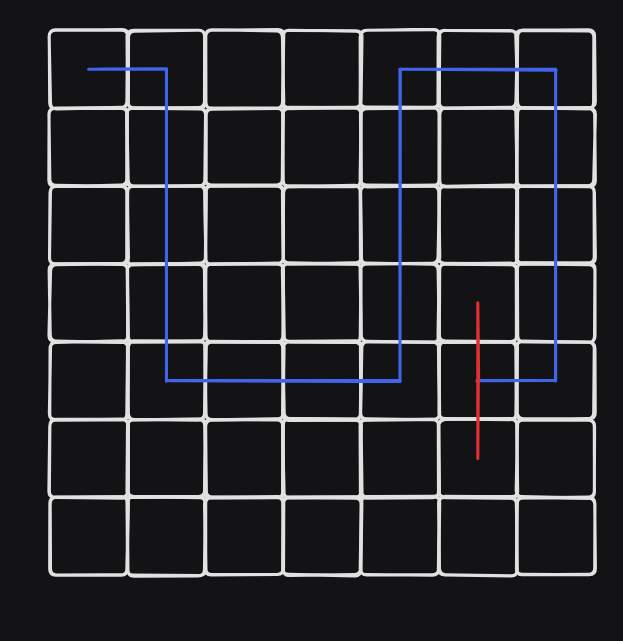

Grid Paths
===

題目
---
在一個 $7 \times 7$ 的格子內，根據一定的步驟，有幾種方法可以從左上角走到左下角？
步驟總共有 $48$ 個字元，包含 `U` `R` `D` `L` 和 `?`，分別代表 `上` `右` `下` `左` 和 `四個方位都可以`。 

例 : DRURRRRRDDDLUULDDDLDRRURDDLLLLLURULURRUULDLLDDDD



### 輸入
長度為 48 的字串，且只包含 `U` `R` `D` `L` 和 `?`

### 輸出
有幾種走法

範例測資
---
```
Input : 
??????R??????U??????????????????????????LD????D?

Output : 
201
```

想法
---
如果暴力走完的話肯定會 TLE ，以下將介紹幾種剪枝優化方法

#### 優化 1 : 
若在 $48$ 步以前就走到左下角，之後必定不可能再走到左下角

#### 優化 2 : 
如果遇到牆壁或是已經走過的地方，且左右兩邊都還有沒走過的格子，那麼必定無法走完整張圖



#### 優化 3 :
根據優化 2 ，我們可以知道只要將整張圖分成兩部分就是一個不合法的狀況，因此前面的點已經走過，且左右邊都沒走過，就可以不用繼續走下去



實作細節
---
我們可以在把 $ 7 \times 7$ 的地圖擴大成 $ 9 \times 9$，並且把最外圍的地方全部設置成已經走過的地方，這樣可以省下判斷邊界的時間

### 範例程式碼
<details>
<summary>C++ 範例 </summary>
```cpp
#include<bits/stdc++.h>
#define int long long
using namespace std;
 
string str;
int ans = 0;
bool vis[9][9];
int dx[4] = {0, 0, 1, -1};
int dy[4] = {1, -1, 0, 0};
 
void dfs(int now,int x,int y) {
    vis[x][y] = true;
    if(x == 7 && y == 1) {
        if(now == 48) {
            ans++;
        }
        return;
    }
    if(now == 48) {
        return;
    }
    if(vis[x][y + 1] == true && vis[x][y - 1] == true && vis[x - 1][y] == false && vis[x + 1][y] == false) {
        return;
    }
    if(vis[x][y + 1] == false && vis[x][y - 1] == false && vis[x - 1][y] == true && vis[x + 1][y] == true) {
        return;
    }
    if(str[now] == 'R') {
        if(vis[x][y + 1] == false) {
            dfs(now + 1, x, y + 1);
            vis[x][y + 1] = false;
        }
    }
    else if(str[now] == 'L') {
        if(vis[x][y - 1] == false) {
            dfs(now + 1, x, y - 1);
            vis[x][y - 1] = false;
        }
    }
    else if(str[now] == 'U') {
        if(vis[x - 1][y] == false) {
            dfs(now + 1, x - 1, y);
            vis[x - 1][y] = false;
        }
    }
    else if(str[now] == 'D') {
        if(vis[x + 1][y] == false) {
            dfs(now + 1, x + 1, y);
            vis[x + 1][y] = false;
        }
    }
    else {
        for(int i=0;i<4;i++) {
            if(vis[x + dx[i]][y + dy[i]] == false)
            {
                dfs(now + 1, x + dx[i], y + dy[i]);
                vis[x + dx[i]][y + dy[i]] = false;
            }
        }
    }
}
 
signed main()
{
    cin>>str;
    memset(vis,true,sizeof(vis));
    for(int i = 1; i < 8; i++) {
        for(int j = 1; j < 8; j++) {
            vis[i][j] = false;
        }
    }
    dfs(0, 1, 1);
    cout << ans;
}
```
</details>